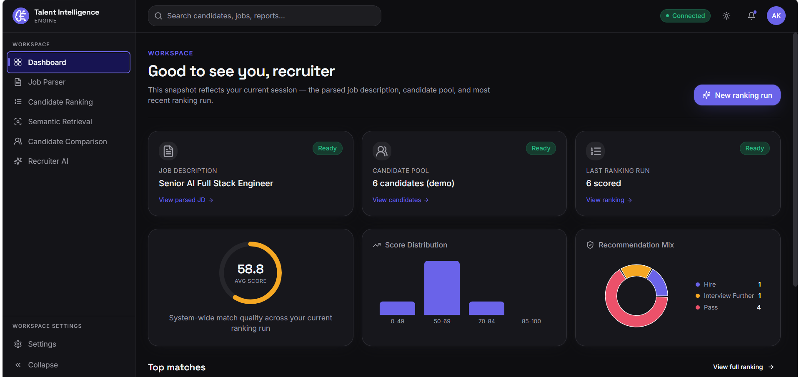
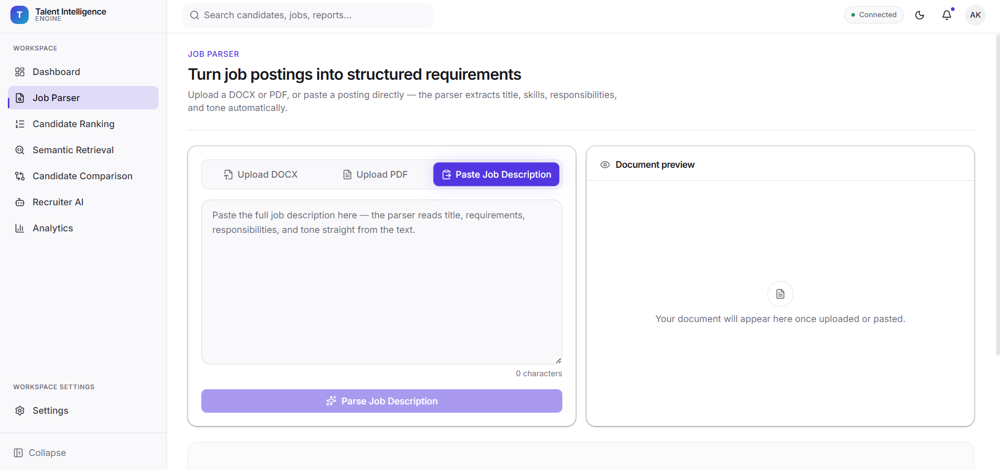
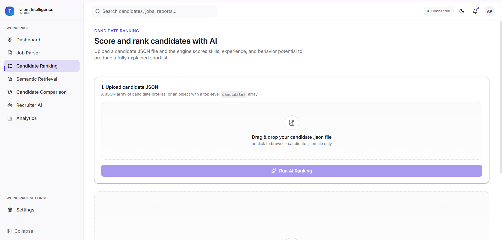
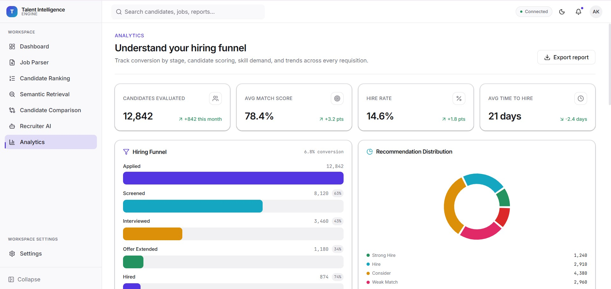

# Talent Intelligence Engine  
### AI-Powered Candidate Ranking Beyond Keyword Matching

> Recruiters go through hundreds of profiles and still miss great candidates—not because talent isn’t there, but because traditional ATS systems rely too heavily on keyword matching.

Talent Intelligence Engine is an AI-powered recruitment system that evaluates candidates the way a strong recruiter would: by understanding **skills, experience, career growth, behavioral signals, and hidden potential**.

Instead of asking *“Does this resume contain the right keywords?”*, this system asks:

- Is this candidate genuinely qualified?
- Does their career trajectory align with the role?
- Are they likely to succeed long-term?
- What strengths and risks should recruiters know?

---

# Problem Statement

Traditional hiring pipelines are broken.

Most ATS systems:
- Over-prioritize keyword matches
- Ignore career progression
- Miss behavioral indicators
- Fail to identify hidden high-potential candidates

This results in:
- Great candidates being filtered out
- Poor shortlist quality
- High recruiter workload

We built Talent Intelligence Engine to solve this.

---

# Solution Overview

Talent Intelligence Engine simulates how a skilled recruiter evaluates talent.

The system:

1. Parses and understands the Job Description
2. Evaluates each candidate across multiple dimensions
3. Scores current fit + future potential
4. Produces an explainable ranked shortlist
5. Enables recruiter interaction via AI chat

---

# Key Features

## 1. Intelligent Job Description Parsing
Extracts and understands:
- Role
- Required skills
- Preferred skills
- Experience expectations
- Behavioral expectations

Example:
```json
{
  "role": "Machine Learning Engineer",
  "required_skills": ["Python", "LLM", "FastAPI"],
  "preferred_skills": ["AWS", "LangChain"],
  "min_experience": 3,
  "behavior_traits": ["ownership mindset"]
}
```
# UI Preview

## Dashboard
Central control panel for JD parsing, candidate ranking, and recruiter analysis.



---

## Job Description Parser
Parses job descriptions into structured hiring signals including skills, experience, and behavioral expectations.



---

## Candidate Ranking
Ranks candidates using multi-dimensional scoring across skills, experience, trajectory, and potential.



---

## Candidate Analysis
Detailed explainability engine showing strengths, risks, and recommendation rationale.



---

## 2. Multi-Dimensional Candidate Ranking

Each candidate is scored across 5 dimensions:

### Skill Match
How closely candidate skills align with JD requirements.

### Experience Relevance
Measures role relevance and years of experience.

### Career Trajectory
Evaluates progression and growth patterns.

### Behavioral Signals
Analyzes certifications, hackathons, GitHub activity, learning consistency.

### Hidden Potential
Identifies strong candidates who may not match traditional filters.

---

## 3. Hybrid AI Scoring Engine

Final score combines:

```text
Final Score =
Weighted Skill Score +
Experience Score +
Trajectory Score +
Behavior Score +
Potential Score
```

This enables more human-like ranking.

---

## 4. Explainable AI Recommendations

Every ranked candidate includes:

- Strengths
- Risks
- Detailed explanations
- Final recommendation

Example:

```json
{
  "recommendation": "Strong Hire",
  "standout_strengths": [
    "Excellent skill alignment",
    "Strong learning consistency"
  ],
  "key_risks": [
    "Limited leadership exposure"
  ]
}
```

This makes recruiter decisions more trustworthy.

---

## 5. Semantic Retrieval (FAISS)

Supports intelligent candidate retrieval using embeddings.

Enables:
- Semantic candidate search
- Faster recruiter discovery
- Better shortlist quality

Example queries:
- "Strong backend engineers with AI exposure"
- "Candidates with leadership potential"

---

## 6. AI Recruiter Chat

Interactive recruiter assistant for deeper analysis.

Examples:
- Why is Candidate A ranked higher?
- Who has strongest future potential?
- Compare top 3 candidates

---

## 7. Candidate Comparison Engine

Compare candidates head-to-head across dimensions:
- Skills
- Experience
- Potential
- Recommendation

This improves final hiring decisions.

---

# System Architecture

```text
                ┌────────────────────┐
                │ Job Description     │
                └──────────┬─────────┘
                           │
                           ▼
                 ┌──────────────────┐
                 │ JD Parser Engine │
                 └──────────┬───────┘
                            │
                            ▼
        ┌─────────────────────────────────────┐
        │ Candidate Intelligence Engine       │
        │ - Skill Analysis                    │
        │ - Experience Scoring                │
        │ - Behavioral Evaluation             │
        │ - Potential Detection               │
        └───────────────┬─────────────────────┘
                        │
                        ▼
             ┌────────────────────┐
             │ Ranking Engine      │
             └──────────┬─────────┘
                        │
         ┌──────────────┼──────────────┐
         ▼              ▼              ▼
 ┌────────────┐ ┌─────────────┐ ┌─────────────┐
 │ Retrieval  │ │ AI Chat     │ │ Comparison  │
 └────────────┘ └─────────────┘ └─────────────┘
```

---

# Tech Stack

## Backend
- Python
- FastAPI
- Pydantic

## AI / ML
- LLM-based reasoning
- Semantic retrieval
- FAISS
- Hybrid scoring models

## Frontend
- React
- TypeScript

---

# Project Structure

```bash
talent-intelligence-engine/
│
├── src/
│   ├── routes/
│   ├── services/
│   ├── models/
│   └── utils/
│
├── competition/
├── data/
├── requirements.txt
├── main.py
└── README.md
```

---

# API Endpoints

## JD Parsing
`POST /jd/parse-jd`

## Candidate Ranking
`POST /ranking/rank`

## Semantic Retrieval
`POST /retrieval/retrieve`

## Recruiter Chat
`POST /chat/chat`

## Candidate Comparison
`POST /compare/compare`

---

# Results

The system successfully:
- Parses job descriptions intelligently
- Evaluates candidates across multiple dimensions
- Produces explainable rankings
- Improves recruiter decision quality

Core outcomes:
- Better candidate discovery
- Better shortlist quality
- Lower recruiter effort
- More intelligent hiring

---

# Why This Matters

Hiring is one of the highest-impact decisions any organization makes.

Yet most hiring systems still operate on outdated filtering logic.

Talent Intelligence Engine rethinks recruitment by introducing intelligence, explainability, and human-like reasoning into candidate evaluation.

This is not just a resume filter.

This is AI-assisted hiring intelligence.

---

# Future Improvements

- Fine-tuned ranking models
- Interview intelligence scoring
- Bias reduction mechanisms
- Resume embeddings at scale
- Production deployment

---

# Submission Assets

- Source Code
- PPT / Architecture Deck
- Ranked Output File

---

# Team Vision

We believe hiring should be smarter.

The best candidates are not always the loudest on paper.  
They are often hidden in plain sight.

Talent Intelligence Engine helps recruiters find them.
